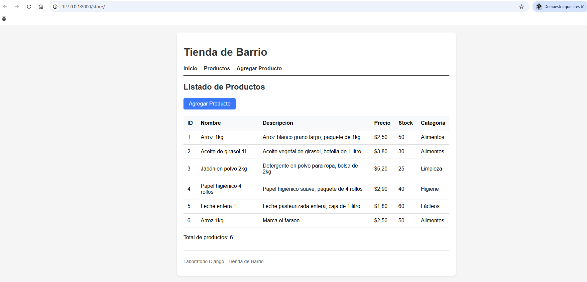
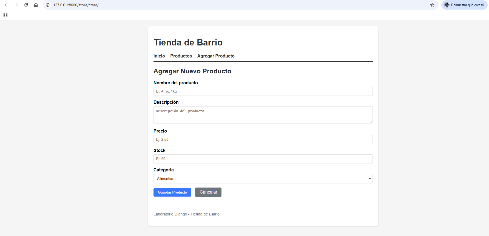
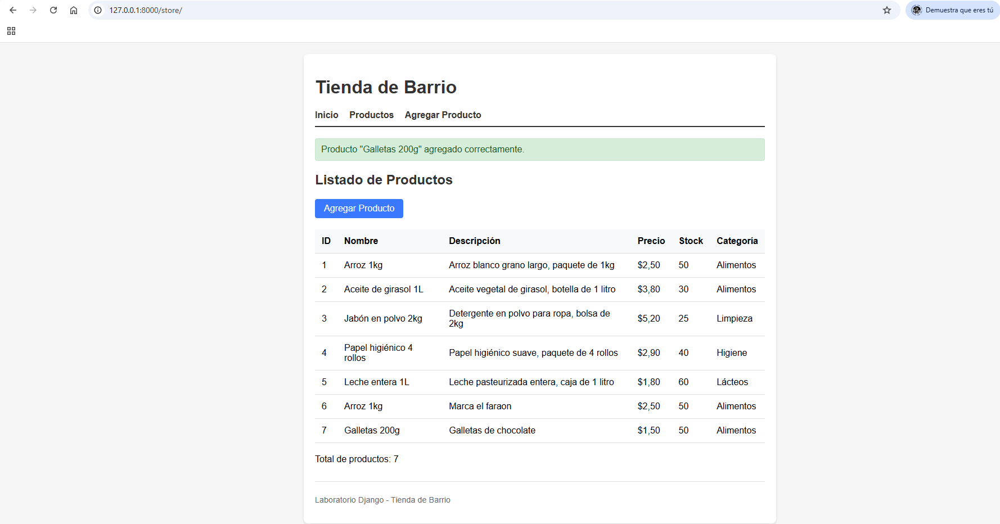

# Laboratorio 02 - Tienda de Barrio (Django MVT)

## Problemática (Ejercicio 1)
Una tienda de barrio necesita una aplicación web sencilla para gestionar sus productos. El dueño de la tienda quiere poder ver el listado de productos disponibles y agregar nuevos productos al inventario. La aplicación será usada por el dueño y empleados de la tienda para llevar control básico del stock.

## Requisitos Funcionales (Ejercicio 2)
1. El sistema debe permitir ver el listado completo de productos con sus detalles (nombre, descripción, precio, stock, categoría).
2. El sistema debe permitir agregar un nuevo producto al inventario.
3. El sistema debe validar que el nombre, descripción, precio, stock y categoría sean obligatorios al crear un producto.
4. El sistema debe mostrar un mensaje de confirmación al agregar un producto exitosamente.
5. El sistema debe redirigir al listado después de crear un producto para verificar que aparece.
6. El sistema debe mostrar errores de validación si los datos ingresados no son correctos.

## Modelo de Datos (Ejercicio 3)
**Entidad principal: Producto**

| Campo | Tipo | Obligatorio | Justificación |
|-------|------|-------------|---------------|
| id | Entero | Sí | Identificador único para cada producto (auto-generado) |
| nombre | Texto (100) | Sí | Nombre del producto para identificación (Req 1, 2, 3) |
| descripcion | Texto largo | Sí | Detalles del producto para el cliente (Req 1, 3) |
| precio | Decimal (10,2) | Sí | Precio de venta, debe ser >= 0 (Req 1, 3) |
| stock | Entero | Sí | Cantidad disponible en inventario, debe ser >= 0 (Req 1, 3) |
| categoria | Texto (opciones) | Sí | Clasificación del producto (Alimentos, Bebidas, Limpieza, Higiene, Lácteos, Otros) (Req 1, 3) |

## Estructura del Proyecto
```
Laboratorio02/
├── config/                 # Configuración del proyecto Django
│   ├── settings.py
│   ├── urls.py
│   └── ...
├── core/                   # App principal (página de inicio)
│   ├── views.py
│   ├── urls.py
│   └── ...
├── store/                  # App de la tienda (productos)
│   ├── models.py           # Datos estáticos (lista de Productos)
│   ├── views.py            # Listado y creación
│   ├── forms.py            # Formulario ProductoForm
│   ├── urls.py
│   └── ...
├── templates/
│   ├── base.html           # Plantilla base
│   ├── home.html           # Página de inicio
│   └── store/
│       ├── producto_list.html
│       └── producto_form.html
├── manage.py
├── requirements.txt
└── README.md
```

## Flujo MVT Aplicado (Ejercicio 9)

### Request → URL → View → Model → Template → Response

1. **Request**: Usuario accede a `/store/`
2. **URL**: `config/urls.py` incluye `store.urls` → `path('', views.producto_list, name='producto_list')`
3. **View**: `store/views.py` → `producto_list(request)` obtiene `PRODUCTOS` de `models.py`
4. **Model (datos estáticos)**: `store/models.py` → lista `PRODUCTOS` (en memoria, sin BD)
5. **Template**: `templates/store/producto_list.html` hereda de `base.html`, itera `productos`
6. **Response**: HTML renderizado enviado al navegador

### Crear producto (POST)
1. **Request**: Usuario envía formulario en `/store/crear/`
2. **URL**: `store/urls.py` → `path('crear/', views.producto_create, name='producto_create')`
3. **View**: `producto_create(request)` valida `ProductoForm`, crea `Producto` con `get_next_id()`, llama `add_producto()`
4. **Model**: Agrega a lista `PRODUCTOS` en memoria
5. **Redirect**: `redirect('producto_list')` → nuevo GET a listado
6. **Response**: Listado actualizado con nuevo producto

**Nota**: Al no usar base de datos, los datos agregados se pierden al reiniciar el servidor. Esto es esperado según el enunciado.

## Convivencia con core
- `core` maneja la página de inicio (`/`)
- `store` maneja los productos (`/store/`, `/store/crear/`)
- Ambas apps registradas en `INSTALLED_APPS`
- Comparten `base.html` y configuración de `config/settings.py`
- URLs incluidas en `config/urls.py` con `include()`

## Instalación y Ejecución
```bash
pip install -r requirements.txt
python manage.py runserver
```

Acceder a:
- Inicio: http://127.0.0.1:8000/
- Productos: http://127.0.0.1:8000/store/
- Agregar: http://127.0.0.1:8000/store/crear/

## Capturas de pantalla (Ejercicio 9)

### 1. Listado de productos



### 2. Formulario de creación



### 3. Nuevo registro reflejado en el listado


